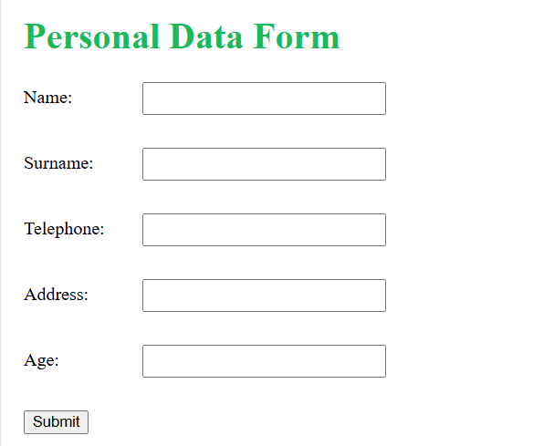
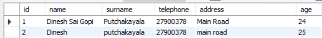

# Personal Data Web Application

This is a Flask-based web application for managing personal data. It allows users to submit their personal information (name, surname, telephone, address, and age) through a form, which is then stored in a MySQL database. The application also displays all submitted data in a table.

## Features
- Submit personal data through a web form.
- Store data in a MySQL database.
- Display all stored data in a table.
- Responsive and clean user interface.

## Prerequisites
- Python 3.x
- MySQL Server
- Flask
- PyMySQL

## Installation

1. **Clone the repository:**
   git clone https://github.com/your-username/personal-data-app.git
   cd personal-data-app

 2. **Set up a virtual environment (optional but recommended):**
 python -m venv venv
source venv/bin/activate  # On Windows: venv\Scripts\activate

3. **installation dependenices:**
pip install -r requirements.txt

4. **Set up the MySQL database:**
Create a database named personal_data.
Update the database configuration in app.py with your MySQL credentials:

db_config = {
    'host': 'localhost',
    'user': 'root',  # Replace with your MySQL username
    'password': 'Sabiha@231101',  # Replace with your MySQL password
    'database': 'personal_data'
}

5. **Run the application:**

Run application by clicking python file which is named as app.py

6. **Access the application:**
Open your browser and go to http://localhost:5000.

7. **screenshots:**
personal_data form screenshot

table screenshot

database MYSQL screenshot 

7. **project structure:**

flask_app/
├── app.py                  # Main Flask application
├── templates/
│   └── index.html          # HTML template for the form and table
├── static/
│   └── styles/
│       └── style.css       # CSS file for styling
├── requirements.txt        # List of dependencies
└── README.md               # Project documentation

